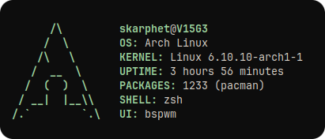

<div align="center">


[](https://github.com/dybdeskarphet/mcfetch/releases/latest)
[](https://aur.archlinux.org/packages/mcfetch-git)
[](https://crates.io/crates/mcfetch)

<a href="#-installation"><kbd> <br>Installation<br> </kbd></a> <a href="#-usage"><kbd> <br>Usage<br> </kbd></a> <a href="#-uninstallation"><kbd> <br>Uninstallation<br> </kbd></a>

</div>

---

# 🌈 mcfetch

_mcfetch (monochromatic fetch)_ is a lightweight system information fetching program, similar to ufetch but with color options.

## 🔧 Installation

### Using Installation Script

Quickly install `mcfetch` with a one-liner:

```bash
bash <(curl -L https://raw.githubusercontent.com/dybdeskarphet/mcfetch/main/install.sh)
```

### From crates.io

If you have Rust and Cargo installed, you can install `mcfetch` directly from Crates.io:

```bash
cargo install mcfetch
```

### From the Arch User Repository (AUR)

For Arch-based Linux distributions, install [**mcfetch**](https://aur.archlinux.org/packages/mcfetch-git) from the AUR:

```bash
# For paru users
paru -S mcfetch-git
# For yay users
yay -S mcfetch-git
```

### Manual Installation

Clone the repository, build the binary, and move it to your PATH:

```bash
git clone https://github.com/dybdeskarphet/mcfetch.git
cd mcfetch
cargo build --release
sudo mv target/release/mcfetch /usr/bin/
```

## ✨ Usage

Run `mcfetch` with your preferred color:

```bash
mcfetch --color <COLOR>
```

Example:

```bash
mcfetch --color blue
```

## 🚮 Uninstallation

If you installed mcfetch using the **installation script**, you can uninstall it easily:

```bash
bash <(curl -L https://raw.githubusercontent.com/dybdeskarphet/mcfetch/main/install.sh) --uninstall
```

This will remove the mcfetch binary from your system.

If you installed it manually or through cargo, remove it as follows:

- **Cargo uninstallation:**

```bash
cargo uninstall mcfetch
```

- **Manual uninstallation:**

```bash
sudo rm /usr/bin/mcfetch
```

- **Aur uninstallation:**

```bash
# For paru users
paru -R mcfetch-git
# For yay users
yay -R mcfetch-git
```

<br>

## 📜 License

This project is licensed under the GNU General Public License v3.0.
See the [LICENSE](https://github.com/dybdeskarphet/mcfetch/blob/main/LICENSE) file for more details.
